<!--
Eclipse Tractus-X - Industry Core Hub

Copyright (c) 2026 LKS Next
Copyright (c) 2026 Contributors to the Eclipse Foundation

See the NOTICE file(s) distributed with this work for additional
information regarding copyright ownership.

This work is made available under the terms of the
Creative Commons Attribution 4.0 International (CC-BY-4.0) license,
which is available at
https://creativecommons.org/licenses/by/4.0/legalcode.

SPDX-License-Identifier: CC-BY-4.0
-->

# CCM KIT User Guide

Status: Draft
Type: Documentation

## Overview
- **Purpose:** Teach a first-time user how to use the **Company Certificate Management (CCM) KIT** inside the Industry Core Hub — screen by screen, click by click.
- **Audience:** Frontend users/operators who want to create, share, request and consume compliance certificates across the Catena-X dataspace. No prior experience with the interface is assumed.
- **Outcome:** You can create a certificate, provide it to a partner in all four ways (responding vs sending, available vs push), and — as a consumer — request, download and give feedback on a certificate.

## What is the CCM KIT?
The CCM KIT lets companies exchange **compliance certificates** (for example ISO 9001, ISO 14001, IATF 16949) with full request, response and feedback tracking.

There are **four ways** to share a certificate, decided by two questions: **who starts** the exchange, and **how** the certificate is delivered.

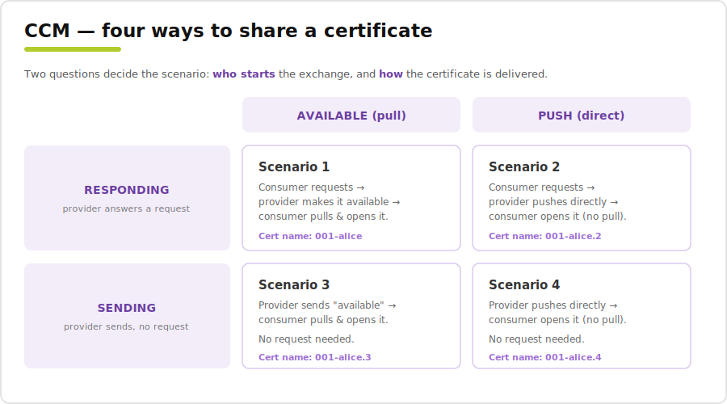

- **Delivery — AVAILABLE (pull)** vs **PUSH (direct):** with *available*, the consumer must pull/download the document before opening it; with *push*, the provider sends the document directly and the consumer can open it straight away.
- **Trigger — RESPONDING** vs **SENDING:** with *responding*, the provider answers a consumer request; with *sending*, the provider sends proactively with no prior request.

This guide walks through all four scenarios.

> In the screenshots, an **orange** address bar (or an orange **PROVIDER** tag on dialogs) marks provider actions; a **green** address bar / **CONSUMER** tag marks consumer actions.

## Find the CCM KIT
The **CCM** group in the left sidebar contains the three screens you will use.

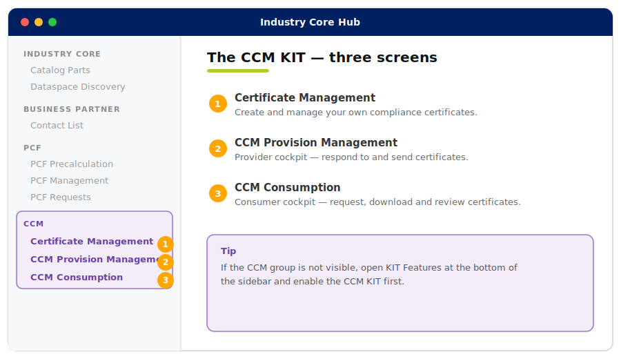

| # | Screen | Who uses it | What it does |
|---|--------|-------------|--------------|
| 1 | **Certificate Management** | Everyone | Create and manage your own certificates. |
| 2 | **CCM Provision Management** | Provider | Respond to incoming requests and send certificates. |
| 3 | **CCM Consumption** | Consumer | Request, download and review certificates. |

---

# Part 1 — Certificate Management (create a certificate)

Before you can share anything, you create the certificate here.

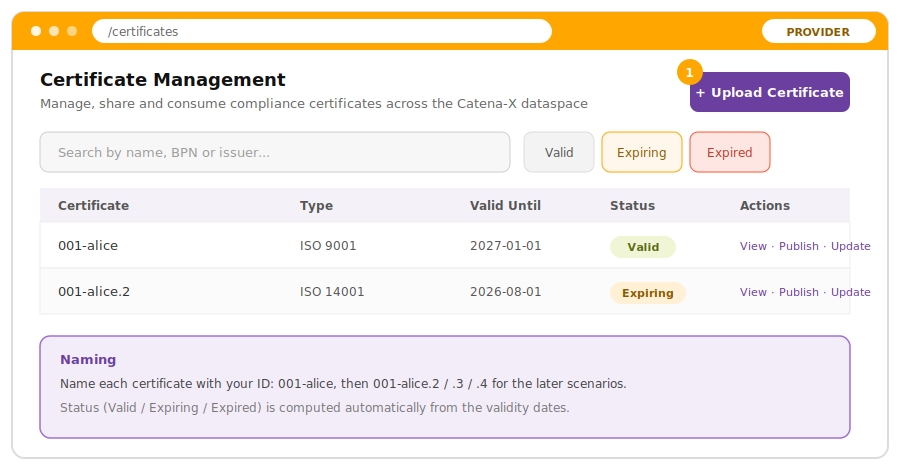

- **① Upload Certificate** — opens the 3-step creation wizard.
- The **search** and the **Valid / Expiring / Expired** quick filters help you find certificates. The status is computed automatically from the validity dates.

## Create a certificate step by step
Click **Upload Certificate**. The wizard has three steps.

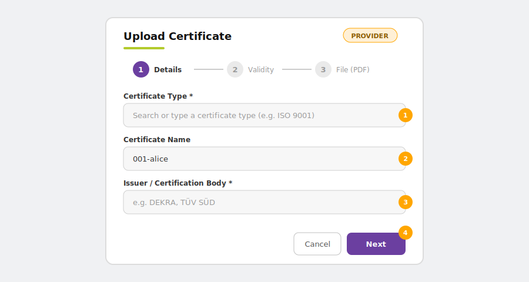

**Step 1 — Details**
- **① Certificate Type** (required) — search or pick a type (ISO 9001, ISO 14001, IATF 16949, …). *This tells partners what kind of certificate it is.*
- **② Certificate Name** — use your ID (e.g. `001-alice`). *This is how you recognise it later.*
- **③ Issuer / Certification Body** (required) — who issued it (e.g. DEKRA, TÜV SÜD).
- **④ Next** — go to the next step.

**Step 2 — Validity & context**

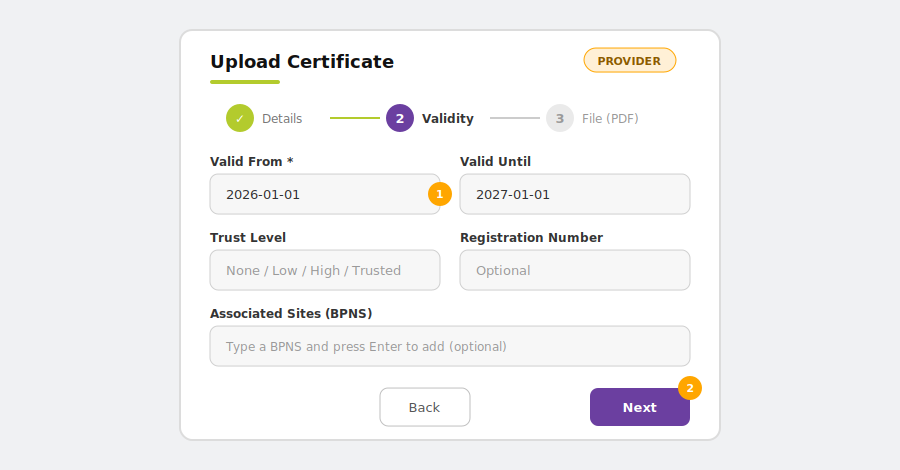

- **① Valid From** (required) and **Valid Until**, plus optional **Trust Level**, **Registration Number**, **Area of Application** and **Associated Sites (BPNS)**.
- **② Next** — go to the file step.

**Step 3 — File**

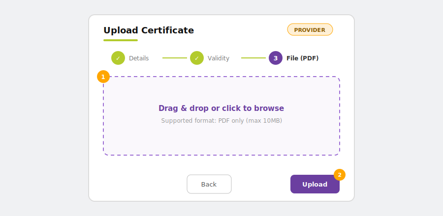

- **① Drop zone** — drag & drop or browse for the **PDF** (max 10 MB).
- **② Upload** — finishes the wizard.

Your certificate now appears in the list, ready to be shared.

---

# Part 2 — Provider: providing certificates

There are two starting points on the provider side, both in **CCM Provision Management**:

- **Responding** — a consumer sent you a request; you answer it from the **Inbound Requests** tab.
- **Sending** — you send proactively (no request) using the **Send Available** or **Push Certificate** buttons.

And two delivery methods for each: **AVAILABLE (pull)** or **PUSH (direct)**.

## Scenario 1 — Responding · Available
### Consumer requests first
The consumer opens **CCM Consumption**, clicks **New Request**, and requests your certificate. The full request flow (with images) is in [Part 3 — Consumer](#consumer-part).

### Provider: answer from Inbound Requests
Open **CCM Provision Management** and stay on the **Inbound Requests** tab.

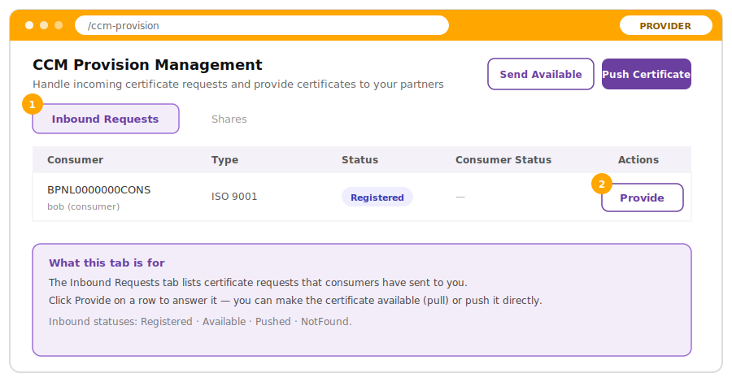

- **① Inbound Requests tab** — lists the certificate requests consumers sent you.
- **② Provide** — click it on the request row to answer.

The **Provide Certificate** dialog opens:

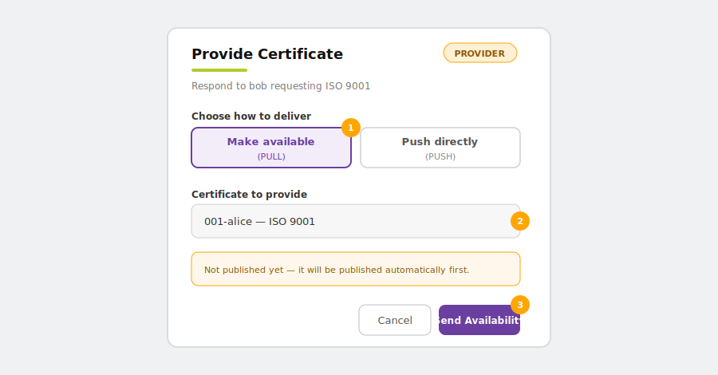

- **① Make available (PULL)** — choose this delivery method.
- **② Certificate to provide** — select the certificate (`001-alice`).
- **③ Send Availability** — sends the availability notification. *If the certificate is not published yet, it is published automatically first.*

### Consumer: pull, open and give feedback
The consumer pulls the document, opens the PDF, and sends feedback — see [Part 3 — Consumer](#consumer-part) for the step-by-step with images.

### Provider: check the result
Open the **Shares** tab to see the status and the consumer's feedback — see [Track your shares](#track-shares) below.

## Scenario 2 — Responding · Push
Same as Scenario 1 up to the **Provide Certificate** dialog, but here you choose **Push directly**. Name this certificate `001-alice.2`.

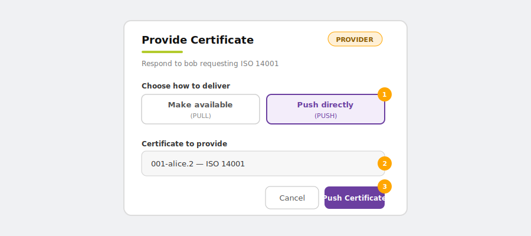

- **① Push directly** — select this delivery method.
- **② Certificate to provide** — select the certificate (`001-alice.2`).
- **③ Push Certificate** — sends the document directly. The consumer receives it ready to open — no pull needed.

The consumer then opens it and sends feedback — see [Part 3 — Consumer](#consumer-part).

## Scenario 3 — Sending · Available
No request needed. In **CCM Provision Management**, click **Send Available** (top of the screen). The **Send Availability Notification** dialog opens:

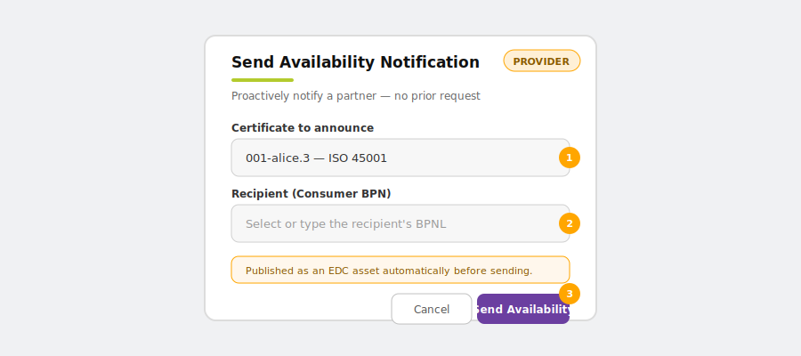

- **① Certificate to announce** — select the certificate (`001-alice.3`).
- **② Recipient (Consumer BPN)** — the partner you send it to.
- **③ Send Availability** — sends it. The consumer then pulls and opens it.

## Scenario 4 — Sending · Push
No request needed. Click **Push Certificate** (top of the screen). The **Push Certificate** dialog opens:

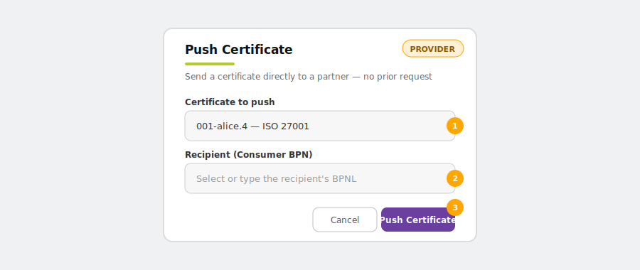

- **① Certificate to push** — select the certificate (`001-alice.4`).
- **② Recipient (Consumer BPN)** — the partner you send it to.
- **③ Push Certificate** — sends the document directly; it arrives ready to open — no pull needed.

## Track your shares
Whatever the scenario, switch to the **Shares** tab to follow every certificate you shared and the consumer's feedback.

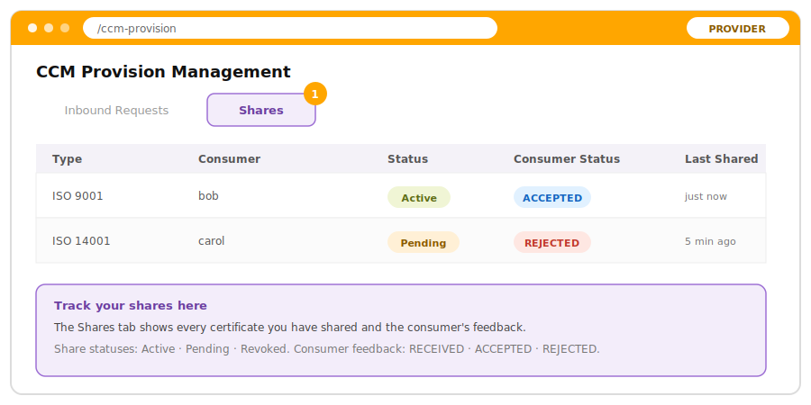

- **① Shares tab** — every certificate you shared, with its **Status** (Active / Pending / Revoked) and the **Consumer Status** feedback (RECEIVED / ACCEPTED / REJECTED).
- A rejection shows a marker you can click to read the consumer's reasons.

---

# Part 3 — Consumer: requesting and reviewing certificates

Everything the consumer does happens in **CCM Consumption**.

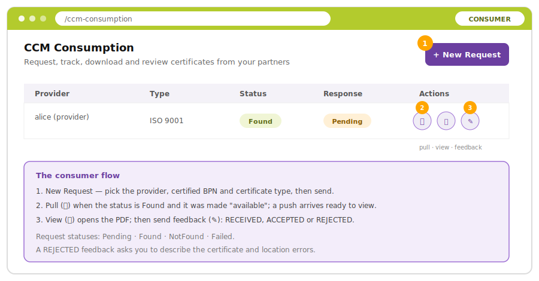

## Step 1 — Request a certificate (Scenarios 1 & 2)
Click **New Request** (top right). The request dialog opens:

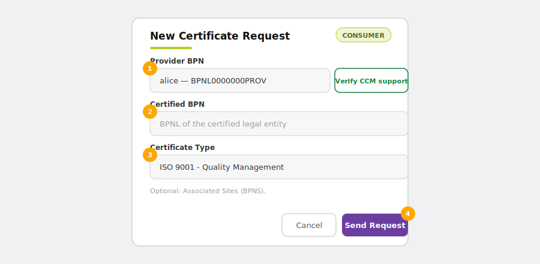

- **① Provider BPN** — the partner that owns the certificate. Optionally click **Verify CCM support** to confirm the provider supports CCM.
- **② Certified BPN** — the legal entity the certificate belongs to.
- **③ Certificate Type** — the type you can see on the provider side.
- **④ Send Request** — the request appears in the table with status **Pending**.

> For **Sending** scenarios (3 & 4) you do **not** send a request — the certificate simply arrives in this table.

## Step 2 — Pull / open the certificate
When the request status is **Found** (or when a sent certificate arrives), use the row action icons:

- **② Pull certificate (⭳)** — for an *available* certificate, download it first. For a *push*, the document is already there.
- **View (👁)** — opens the PDF so you can read it.

## Step 3 — Send feedback
Click the **Send feedback (✎)** icon on the request. Pick one of the three outcomes — the dialog adapts to your choice:

	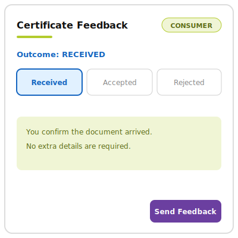
	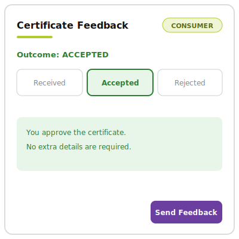
	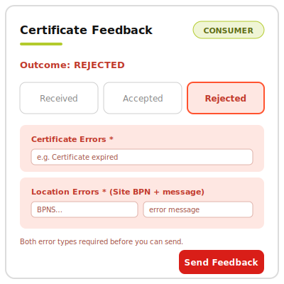

- **RECEIVED** / **ACCEPTED** — no extra details needed; just click **Send Feedback**.
- **REJECTED** — you must add at least one **certificate error** and one **location error** (Site BPN + message) describing what is wrong before you can send.

Your feedback is shown to the provider in their **Shares** tab.

---

## Status Reference
- **Inbound requests (Provision → Inbound):** `Registered`, `Available`, `Pushed`, `NotFound`.
- **Shares (Provision → Shares):** `Active`, `Pending`, `Revoked`.
- **Requests (Consumption):** `Pending`, `Found`, `NotFound`, `Failed`.
- **Consumer feedback (both sides):** `RECEIVED`, `ACCEPTED`, `REJECTED`.
- **Certificate validity (Certificate Management):** `Valid`, `Expiring`, `Expired` (computed from the dates).

## Tips & Troubleshooting
- **The CCM group is missing from the sidebar:** enable the **CCM KIT** in **KIT Features** (bottom of the sidebar).
- **A request stays Pending:** the provider has not answered yet. On the provider side, use **Provide** in **Inbound Requests**.
- **Nothing to download for an "available" certificate:** click **Pull certificate (⭳)** first, then **View**. For a *push*, skip the pull — it is already there.
- **Cannot submit a REJECTED feedback:** a rejection requires at least one certificate-level error and one location-level (BPNS) error.
- **PDF upload fails:** the file must be a **PDF** and under **10 MB**.
- **Naming clash with other participants:** name each certificate with your own ID (`001-alice`, `001-alice.2`, …) so you can find your own among everyone else's.

---

## NOTICE

This work is licensed under the [CC-BY-4.0](https://creativecommons.org/licenses/by/4.0/legalcode).

- SPDX-License-Identifier: CC-BY-4.0
- SPDX-FileCopyrightText: 2026 LKS Next
- SPDX-FileCopyrightText: 2026 Contributors to the Eclipse Foundation
- Source URL: https://github.com/eclipse-tractusx/industry-core-hub