<!--
Eclipse Tractus-X - Industry Core Hub

Copyright (c) 2026 LKS Next
Copyright (c) 2026 Contributors to the Eclipse Foundation

See the NOTICE file(s) distributed with this work for additional
information regarding copyright ownership.

This work is made available under the terms of the
Creative Commons Attribution 4.0 International (CC-BY-4.0) license,
which is available at
https://creativecommons.org/licenses/by/4.0/legalcode.

SPDX-License-Identifier: CC-BY-4.0
-->

# PCF KIT User Guide

Status: Draft
Type: Documentation

## Overview
- **Purpose:** Teach a first-time user how to use the **Product Carbon Footprint (PCF) KIT** inside the Industry Core Hub — screen by screen, click by click.
- **Audience:** Frontend users/operators who want to provide, request, receive and consume PCF data across the Catena-X dataspace. No prior experience with the interface is assumed.
- **Outcome:** You can share a part's PCF directly (SYNC), and you can request, accept and receive a subpart's PCF (ASYNC), understanding what each action does and why.

## What is the PCF KIT?
The PCF KIT lets a company exchange the **carbon-footprint data** of its parts and their subparts.

A simple example runs through this whole guide: you manufacture a **wheel**. A wheel is made of subparts — a **rim** and a **tyre**. To know the wheel's total footprint you need the PCF of each subpart from your suppliers. The PCF KIT lets you request that data, receive it, and aggregate it.

There are **two ways** to exchange PCF data. You will learn both:

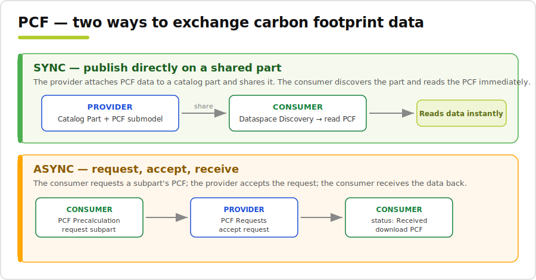

- **SYNC** — the provider attaches PCF data directly to a shared catalog part; the consumer discovers the part and reads the PCF immediately.
- **ASYNC** — the consumer requests a subpart's PCF; the provider accepts the request; the consumer receives the data back.

## Find the PCF KIT
The left sidebar groups features by KIT. The **PCF** group contains the three screens you will use.

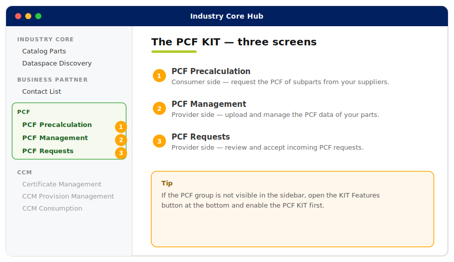

| # | Screen | Who uses it | What it does |
|---|--------|-------------|--------------|
| 1 | **PCF Precalculation** | Consumer | Request the PCF of subparts from your suppliers and aggregate the result. |
| 2 | **PCF Management** | Provider | Upload and manage the PCF data of your own parts. |
| 3 | **PCF Requests** | Provider | Review and accept incoming PCF requests. |

---

# Flow A — SYNC (share PCF directly on a part)

Use this when you already own the PCF data and simply want to publish it on a part so a partner can read it after discovery.

> Screens with an **orange** address bar are provider actions; screens with a **green** address bar are consumer actions.

**1. Open Catalog Parts and click Create Catalog Part.**

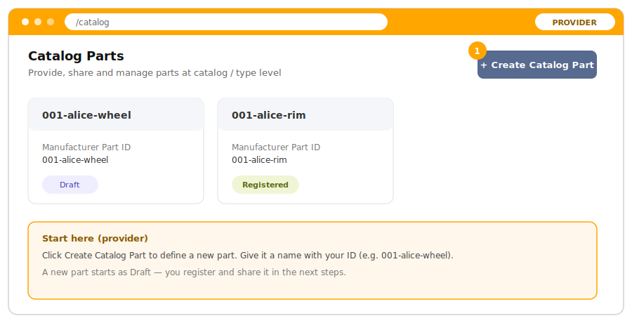

**2. Fill in the new part's fields and click Create.**

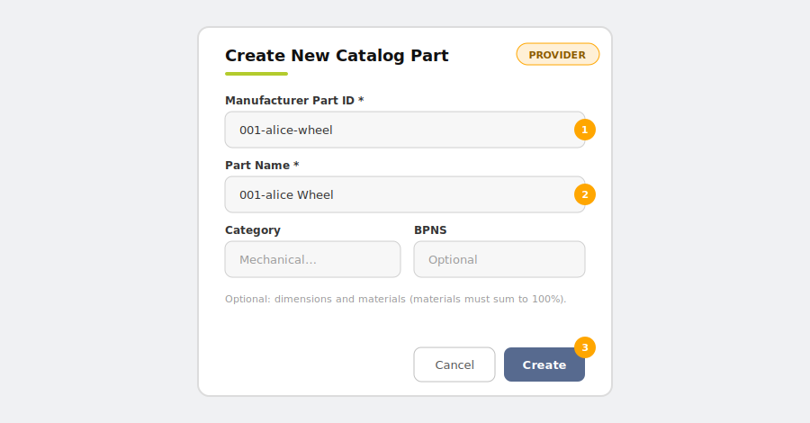

- **① Manufacturer Part ID** — the unique ID of the part (e.g. `001-alice-wheel`). *This is how the part is identified across the dataspace.*
- **② Part Name** — a human-readable name (e.g. `001-alice Wheel`).
- **③ Create** — creates the part; it now exists as a **draft**. You can optionally add **Category**, **BPNS**, dimensions and materials.

**3. Register and share the part — there are two ways to do it.** Both do exactly the same thing; use whichever entry point you prefer.

**Way 1 — the card's three-dots (⋮) menu** in the Catalog Parts list:

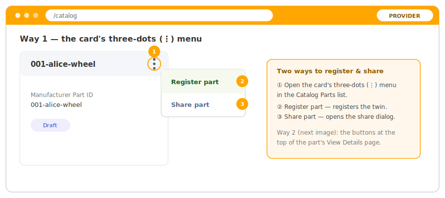

- **① Three-dots (⋮) menu** — open it on the part's card.
- **② Register part** — registers its Digital Twin so it can be shared and discovered.
- **③ Share part** — opens the share dialog.

**Way 2 — the buttons at the top of the part's View Details page** (open the part with **View Details** first):

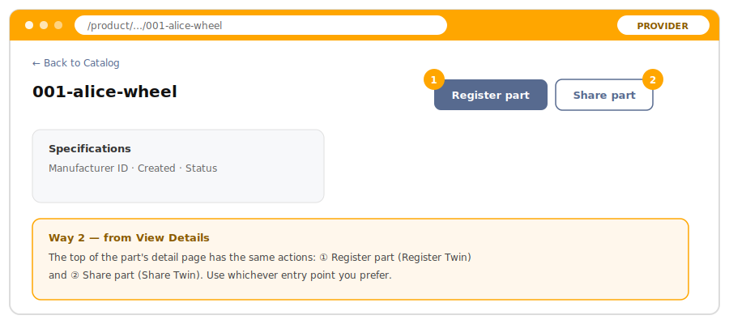

- **① Register part** and **② Share part** are also available at the top of the detail page.

**4. Either way, the Share dialog opens — pick the partner and confirm.**

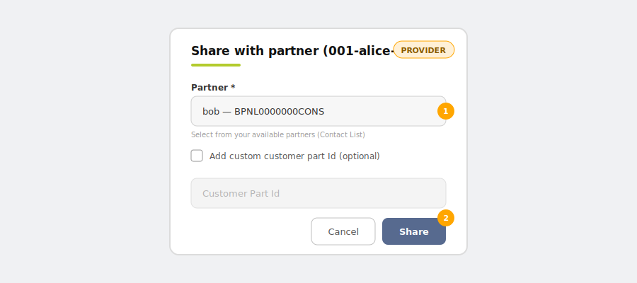

- **① Partner** — choose the consumer's BPNL (from your Contact List). *The part becomes visible to that partner in the dataspace.*
- **② Share** — confirms the share.

## Step 2 — Provider: add the PCF submodel
Open the part with **View Details** and scroll down to the **Submodels** section.

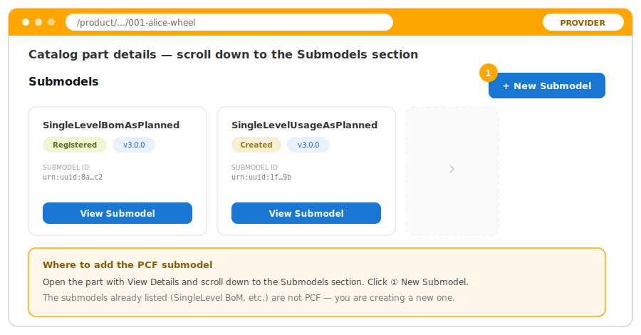

- **① New Submodel** — the button in the header of the **Submodels** section (top-right). It opens the **schema selector**.
- The submodels already listed appear as cards (e.g. **SingleLevelBomAsPlanned**, **SingleLevelUsageAsPlanned**) — these are **not** PCF; you are adding a new one.

In the schema selector choose the **PCF** schema (v9.0.0), fill in the data and save. *A submodel is the structured data attached to the twin — here, the carbon-footprint values.*

> The submodel form itself (schema selector, dynamic fields, validation) is documented step by step in the [Submodel Creator Guide](SUBMODEL_CREATOR_GUIDE.md), which lives next to this guide in `docs/user`.

## Step 3 — Consumer: discover and read the PCF
**1. Go to Dataspace Discovery, choose the provider and start the search.**

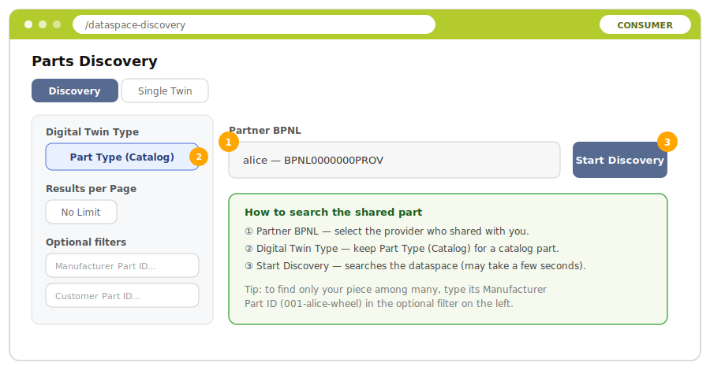

- **① Partner BPNL** — select the provider who shared the part with you.
- **② Digital Twin Type** — keep **Part Type (Catalog)** for a catalog part.
- **③ Start Discovery** — searches the dataspace (this negotiates access with the provider's connector, so it can take a few seconds).
- *Tip:* to find only your piece among many, type its **Manufacturer Part ID** (`001-alice-wheel`) in the optional filter on the left.

**2. In the results, pick your part among all the discovered ones.** Results appear as **cards**.

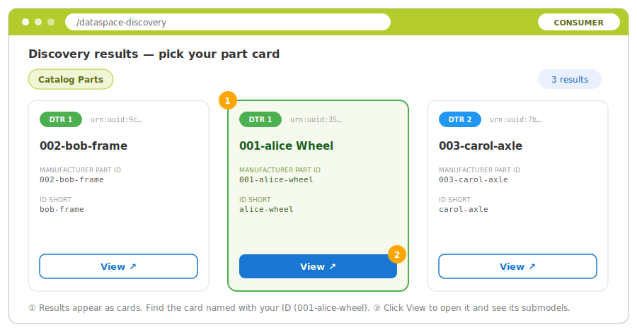

- **① Find the card named with your ID** (`001-alice-wheel`) among the discovered parts.
- **② View** — opens the twin and lists its submodels.

**3. The twin's submodels appear as cards — find the PCF ones.**

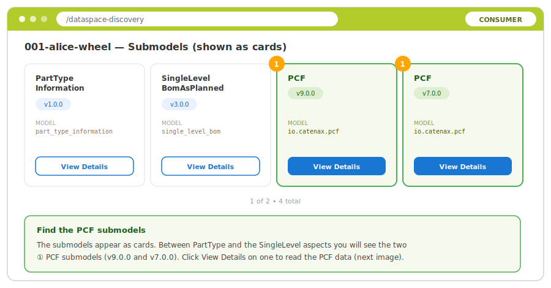

- **①** Among the submodels (PartType, SingleLevel aspects, …) you will see the **two PCF submodels** (v9.0.0 and v7.0.0). Click **View Details** on one.

**4. Read the PCF data and confirm it matches.**

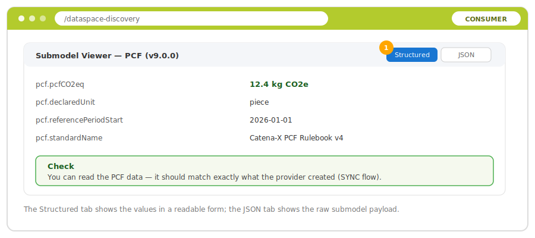

- **① Structured / JSON** — switch views of the data.
- **Check:** you should see exactly the PCF data the provider created.

---

# Flow B — ASYNC (request, accept, receive)

Use this when you are the consumer and you need PCF data that a supplier has not published yet. You will use all three PCF screens.

## Step 1 — Consumer: open your part in PCF Precalculation
1. In **Catalog Parts**, create and **register** the part you are calculating (e.g. `001-alice-wheel`), if it does not exist yet.
2. Go to **PCF Precalculation**.
3. Type the **Manufacturer Part ID** in the search field and click **Calculate PCF**.

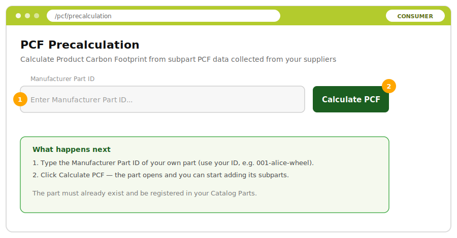

- **① Search field** — enter your own part's Manufacturer Part ID.
- **② Calculate PCF** — opens the part so you can start adding its subparts. *The part must already exist and be registered.*

## Step 2 — Consumer: add a subpart relation
When the part opens, PCF Precalculation is empty — no subparts yet. This is where you add them.

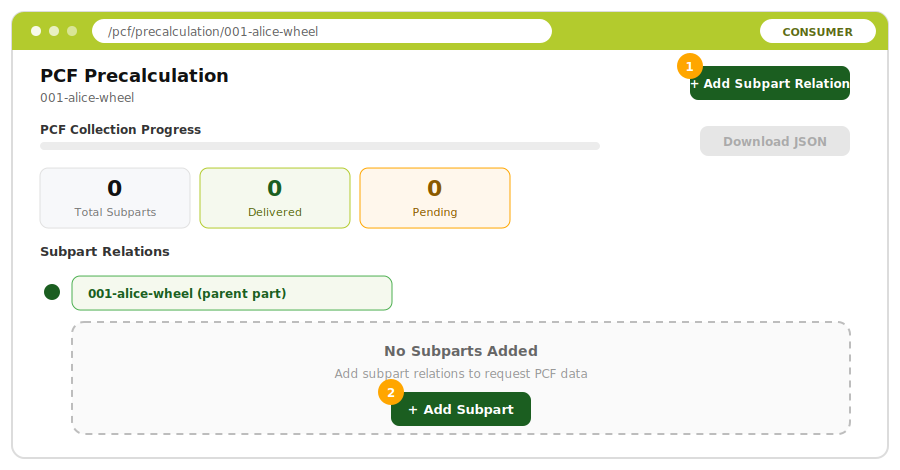

- **① Add Subpart Relation** — the button at the top-right, or **② Add Subpart** in the empty-state card. Either one opens the dialog.

A subpart relation tells the app which supplier part you want a PCF for. Fill in the dialog:

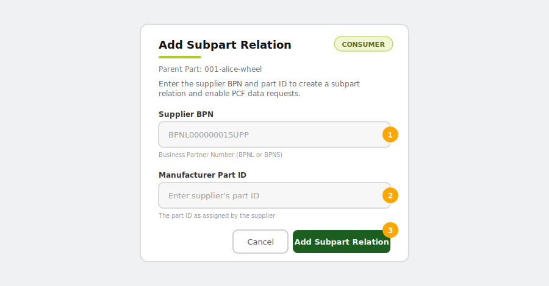

- **① Supplier BPN** — the Business Partner Number of the supplier that owns the subpart (BPNL or BPNS).
- **② Manufacturer Part ID** — the subpart's ID as assigned by that supplier (e.g. `001-alice-rim`).
- **③ Add Subpart Relation** — confirms and adds the subpart to the list with status **Pending**.

Repeat for each subpart (e.g. `rim`, `tyre`).

## Step 3 — Consumer: request the PCF and track progress
The part now shows its subparts and a progress panel.

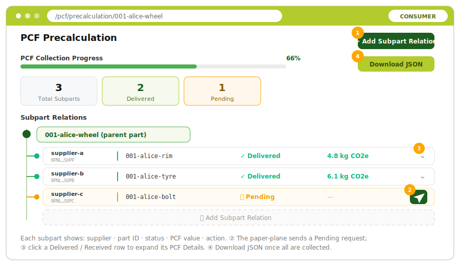

- **① Add Subpart Relation** — add more subparts at any time.
- **② Request PCF (paper-plane icon)** — on a **Pending** subpart, click the paper-plane / send button to send the request to the supplier. *The status moves through sending / awaiting response, and then to **Delivered**.*
- **③ Expand a row** — click a **Delivered / Received** row to see its PCF details (value, delivered date, certificate).
- **④ Download JSON** — once every subpart is collected, export the aggregated PCF.

The three progress cards (**Total Subparts**, **Delivered**, **Pending**) show how far the collection is.

> **What "Delivered" means here:** your request reached the supplier and is being handled on their side. You will see it become **Received** once the supplier accepts and returns the data (Step 5).

## Step 4 — Provider: accept the request in PCF Requests
Switch to the provider side. Open **PCF Requests** — this is the provider's inbox.

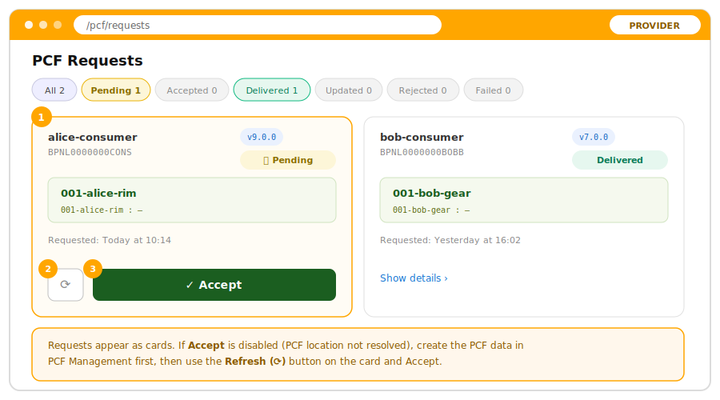

- **① Request cards** — each incoming request is a **card** showing the requester (name + BPNL), the requested part, the PCF version and a status chip. Use the status filters (**Pending / Accepted / Delivered / …**) at the top to focus.
- **② Refresh (⟳)** — re-checks whether the PCF location is available yet.
- **③ Accept** — approve the request and send the PCF back to the consumer. *Enabled only once PCF data exists for that part.*

**If the Accept button is disabled**, it is because no PCF data has been created for that part yet. Do this first:
1. In **Catalog Parts**, create a part named exactly like the requested subpart (`001-alice-rim`) and **register** it.
2. Go to **PCF Management** and create the PCF data for that part — see [Step 5 — PCF Management](#pcf-management) below for how to use that screen and its wizard.
3. Return to **PCF Requests**; the **Accept** button is now enabled — click it.

## Step 5 — Provider: create PCF data in PCF Management
Open **PCF Management** and search your part. Depending on the part, you will see one of **three states**:

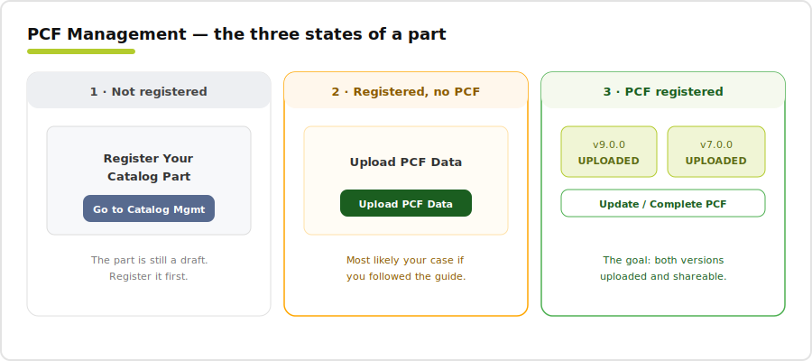

1. **Not registered** — the part is still a draft. The screen asks you to register it first (**Go to Catalog Management**). Register it in **Catalog Parts** and come back.
2. **Registered, no PCF data** — the screen shows **Upload PCF Data**. *This is most likely your case if you followed this guide.*
3. **PCF data registered** — both versions show **UPLOADED**. This is the goal state; from here you can **Update / Complete** the data.

Click **Upload PCF Data** (state 2) to open the **Dual PCF Creation** wizard. It has three steps.

**Wizard step 1 — Create PCF v9.0.0** (the canonical version):

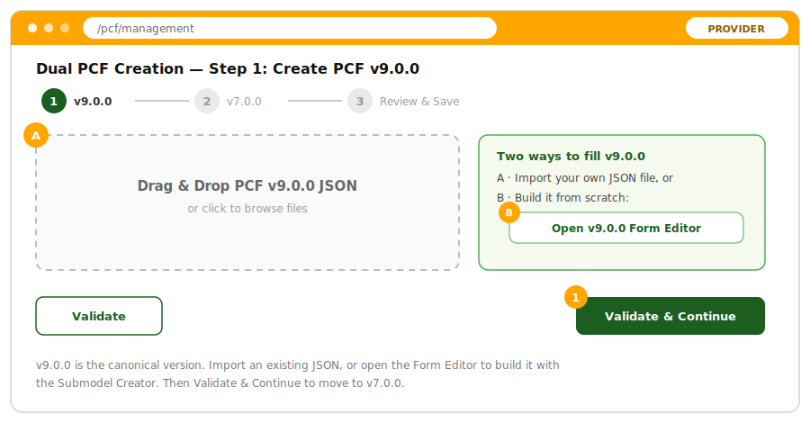

- **A · Import** — drag your own PCF v9.0.0 JSON into the drop zone, **or**
- **B · Build from scratch** — click **Open v9.0.0 Form Editor** to fill it with the Submodel Creator instead of importing your own file.
- **① Validate & Continue** — validates the data and moves on to v7.0.0.

**Wizard step 2 — Create PCF v7.0.0** (pre-filled from v9.0.0):

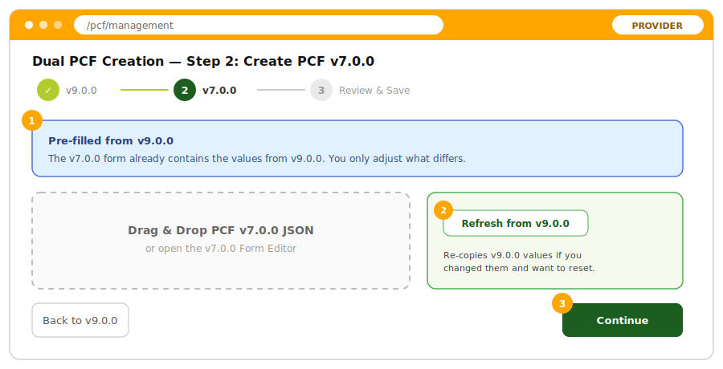

- **① Pre-filled** — v7.0.0 already carries the v9.0.0 values; you only adjust what differs.
- **② Refresh from v9.0.0** — re-copies the v9.0.0 values if you want to reset them.
- **③ Continue** — moves on to Review & Save.

**Wizard step 3 — Review & Save** (reconcile the two versions):

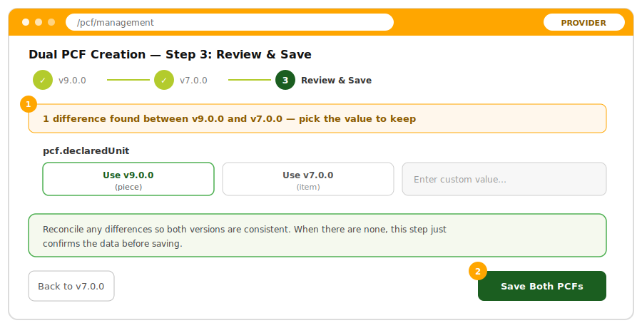

- **① Resolve differences** — for each field that differs between v9.0.0 and v7.0.0, choose **Use v9.0.0**, **Use v7.0.0**, or type a custom value, so both versions stay consistent. This step is what keeps the two PCF versions in sync.
- **② Save Both PCFs** — stores both versions. The part now reaches state 3 (PCF registered).

> **Why two versions?** The PCF standard mandates two schema versions. The wizard lets you create both and reconcile any differences before saving.

## Step 6 — Consumer: receive the data
Back in **PCF Precalculation**, the requested subpart must reach the **Received** status. Then verify the data.

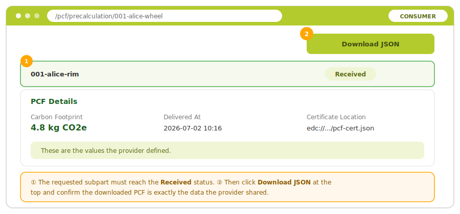

- **① Received** — the requested subpart must show the **Received** status. Expand its row to read the **PCF Details** (carbon-footprint value, delivered date, certificate location).
- **② Download JSON** — click the download button at the top and confirm that the downloaded PCF is exactly the data the provider shared.

## Extra — update and propagate a PCF
1. **Provider:** open **PCF Management** and search the part you provided. It is now in the **PCF registered** state (state 3 above), so it shows an **Update / Complete PCF** button — click it to reopen the **Dual PCF Creation** wizard (see [Step 5](#pcf-management) for how the wizard works).
2. In the wizard, click the **edit** button on the version step you want to change (v9.0.0 or v7.0.0), adjust the values, continue through **Review & Save**, and click **Save Both PCFs**.
3. On save, the **Notify Participants** dialog appears:

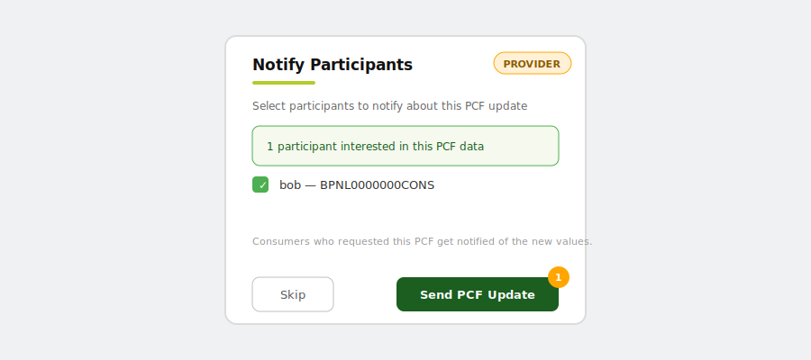

- **① Send PCF Update** — notifies the consumers who already requested this PCF.

4. **Consumer:** in **PCF Precalculation**, confirm the subpart now shows the **Updated** status with the new values.

---

## Status Reference
- **Subpart (PCF Precalculation):** `Pending` → `Delivered` / `Received` → `Updated` (also `Rejected`, `Error`).
- **Request (PCF Requests):** `Pending` → `Accepted` → `Delivered` (also `Rejected`, `Updated`, `Failed`).

## Tips & Troubleshooting
- **The PCF group is missing from the sidebar:** enable the **PCF KIT** in **KIT Features** (bottom of the sidebar).
- **"Calculate PCF" finds nothing:** the part must exist in your **Catalog Parts** and be **registered** first.
- **A subpart stays Pending forever:** the supplier has not accepted the request yet, or has no PCF data for that part. On the provider side, upload the PCF in **PCF Management**, then **Accept** in **PCF Requests**.
- **"Accept" is disabled in PCF Requests:** create the requested part in **Catalog Parts** and upload its PCF in **PCF Management** first.
- **Download JSON is disabled:** it only enables once every subpart has been collected (all **Delivered/Received**).
- **Naming clash with other participants:** always prefix parts with your own ID (e.g. `001-alice-…`) so you can find your own data.

---

## NOTICE

This work is licensed under the [CC-BY-4.0](https://creativecommons.org/licenses/by/4.0/legalcode).

- SPDX-License-Identifier: CC-BY-4.0
- SPDX-FileCopyrightText: 2026 LKS Next
- SPDX-FileCopyrightText: 2026 Contributors to the Eclipse Foundation
- Source URL: https://github.com/eclipse-tractusx/industry-core-hub